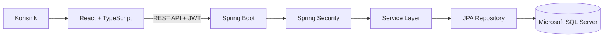
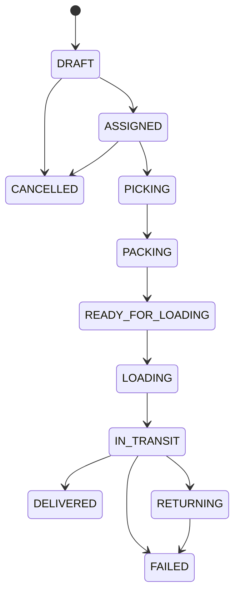

# Logistics System

Savremeni logistički sistemi zahtevaju centralizovano upravljanje skladištima, transportom, zalihama, zaposlenima i operativnim procesima. Cilj ovog projekta je razvoj web aplikacije koja objedinjuje ove funkcionalnosti kroz jedinstven informacioni sistem sa jasno definisanim korisničkim ulogama, kontrolom pristupa i audit mehanizmima.

**Logistics System** predstavlja full-stack aplikaciju razvijenu kao univerzitetski projekat iz oblasti softverskog inženjerstva. Sistem omogućava upravljanje kompletnim logističkim procesima jedne kompanije – od registracije kompanije i upravljanja zaposlenima, preko skladišnih operacija i transportnih naloga, do praćenja aktivnosti korisnika i generisanja poslovnih izveštaja.

Backend je implementiran korišćenjem **Spring Boot** framework-a i izlaže REST API za komunikaciju sa frontend aplikacijom. Frontend je razvijen korišćenjem **React**, **TypeScript** i **Material UI** biblioteka, dok se za čuvanje podataka koristi **Microsoft SQL Server**.

---

# Glavne funkcionalnosti

Sistem obuhvata sledeće funkcionalne celine:

- autentifikaciju korisnika pomoću JWT tokena;
- registraciju kompanija i obradu registracionih zahteva;
- upravljanje korisnicima, zaposlenima i korisničkim ulogama;
- upravljanje skladištima, zonama i bin lokacijama;
- evidenciju proizvoda i stanja zaliha;
- upravljanje inventurnim sesijama i skladišnim operacijama;
- planiranje i praćenje transportnih naloga;
- upravljanje voznim parkom i održavanjem vozila;
- kreiranje, dodelu i praćenje operativnih zadataka;
- pregled dashboard statistike prilagođene korisničkim ulogama;
- sistem notifikacija u realnom vremenu;
- istoriju promena i evidenciju aktivnosti korisnika;
- operativne komentare i priloge (attachments);
- uvoz i izvoz podataka putem CSV fajlova;
- generisanje poslovnih izveštaja.

---

# Arhitektura sistema

Sistem je razvijen kao klasična troslojna web aplikacija.

- **Frontend** predstavlja React SPA aplikaciju koja komunicira sa backend-om putem REST API-ja.
- **Backend** implementira poslovnu logiku, autentifikaciju, autorizaciju i pristup bazi podataka.
- **Baza podataka** čuva sve poslovne podatke i upravlja se Flyway migracijama.



Projekt je organizovan po principu razdvajanja odgovornosti (Separation of Concerns), pri čemu svaki sloj sistema ima jasno definisanu ulogu.

---

# Korišćene tehnologije

## Backend

| Tehnologija | Namena |
|-------------|---------|
| Java 21 | Programski jezik |
| Spring Boot | Razvoj REST aplikacije |
| Spring Security | Autentifikacija i autorizacija |
| Spring Data JPA | Pristup bazi podataka |
| Hibernate | ORM |
| Flyway | Migracije baze |
| Microsoft SQL Server | Sistem za upravljanje bazom podataka |
| JWT | Autentifikacija korisnika |
| Maven | Build alat |
| Lombok | Smanjenje boilerplate koda |
| Spring Validation | Validacija ulaznih podataka |
| Springdoc OpenAPI | Dokumentacija REST API-ja |

## Frontend

| Tehnologija | Namena |
|-------------|---------|
| React | Korisnički interfejs |
| TypeScript | Tipizacija aplikacije |
| Vite | Build alat i razvojno okruženje |
| Material UI | UI komponente |
| TanStack Query | Upravljanje server state-om |
| Axios | HTTP komunikacija |
| React Hook Form | Rad sa formama |
| Zod | Validacija formi |
| Recharts | Grafički prikaz statistike |
| Day.js | Obrada datuma |
| Notistack | Snackbar notifikacije |

---

# Korisničke uloge

Sistem koristi role-based access control (RBAC), pri čemu svaka korisnička uloga ima jasno definisana ovlašćenja.

| Uloga | Opis |
|--------|------|
| **OVERLORD** | Globalni administrator sistema sa potpunim pristupom svim funkcionalnostima. |
| **COMPANY_ADMIN** | Administrator kompanije odgovoran za upravljanje resursima kompanije. |
| **HR_MANAGER** | Upravljanje zaposlenima, korisnicima i radnim smenama. |
| **WAREHOUSE_MANAGER** | Upravljanje skladištima, inventarom i skladišnim operacijama. |
| **DISPATCHER** | Organizacija transporta, vozila i operativnih zadataka. |
| **DRIVER** | Pregled sopstvenih transportnih naloga, zadataka i notifikacija. |
| **WORKER** | Izvršavanje skladišnih zadataka i učešće u inventurnim procesima. |

Sve dozvole u sistemu definišu se na backend-u, dok frontend koristi iste informacije za prikaz odgovarajućih funkcionalnosti korisniku.

---

# Glavni moduli sistema

Aplikacija je organizovana u više funkcionalnih modula koji zajedno čine jedinstven logistički informacioni sistem.

| Modul | Opis |
|--------|------|
| Dashboard | Pregled ključnih statističkih podataka sistema. |
| Kompanije | Upravljanje kompanijama i registracionim zahtevima. |
| Korisnici | Upravljanje korisničkim nalozima i ulogama. |
| Zaposleni | Evidencija zaposlenih i njihovih radnih podataka. |
| Profil | Pregled i izmena ličnih podataka korisnika. |
| Smene | Planiranje i praćenje radnih smena zaposlenih. |
| Skladišta | Upravljanje skladištima, zonama i bin lokacijama. |
| Inventar | Evidencija proizvoda i stanja zaliha. |
| Inventory Count | Organizacija i obrada inventurnih sesija. |
| Stock Movements | Upravljanje svim skladišnim operacijama. |
| Transport Orders | Planiranje i realizacija transporta. |
| Vozila | Upravljanje voznim parkom kompanije. |
| Vehicle Maintenance | Planiranje i evidencija održavanja vozila. |
| Tasks | Kreiranje i praćenje operativnih zadataka. |
| Notifications | Sistem obaveštenja korisnicima. |
| Reports | Generisanje poslovnih izveštaja. |
| Audit | Evidencija promena i aktivnosti u sistemu. |

# Permission model

Kontrola pristupa implementirana je korišćenjem **Spring Security** framework-a i JWT autentifikacije. Backend predstavlja jedini izvor istine za autorizaciju, dok frontend koristi iste informacije kako bi korisniku prikazao samo dozvoljene funkcionalnosti.

Autorizacija se zasniva na kombinaciji:

- korisničke uloge;
- pripadnosti kompaniji;
- ownership proverama;
- entity scope proverama;
- lifecycle pravilima;
- method-level `@PreAuthorize` anotacijama.

Na taj način korisnik može pristupiti isključivo podacima i operacijama koje su predviđene njegovom ulogom.

---

# Lifecycle entiteta

Većina poslovnih entiteta u sistemu koristi unapred definisane lifecycle statuse kako bi se sprečili nedozvoljeni prelazi između stanja.

Najvažniji lifecycle modeli implementirani u sistemu su:

- Transport Order
- Task
- Vehicle
- Stock Movement
- Inventory Count
- Shift
- Vehicle Maintenance

Primer lifecycle-a transportnog naloga:



Sva pravila dozvoljenih prelaza implementirana su na backend-u i validiraju se pre svake promene statusa.

---

# Struktura projekta

```
logistics-system
│
├── backend
│   ├── controller
│   ├── service
│   ├── repository
│   ├── entity
│   ├── dto
│   ├── security
│   ├── config
│   ├── scheduler
│   └── resources
│
├── frontend
│   ├── app
│   ├── core
│   ├── features
│   ├── shared
│   └── assets
│
└── README.md
```

Backend je organizovan po slojevima, dok frontend koristi **feature-based** organizaciju, što olakšava održavanje i proširivanje sistema.

---

# Instalacija projekta

## Preduslovi

Za pokretanje sistema potrebno je imati instalirano:

- Java 21
- Node.js
- Microsoft SQL Server
- Git

---

## Kloniranje repozitorijuma

```bash
git clone <repository-url>

cd logistics-system
```

---

## Pokretanje backend-a

```bash
cd backend

./mvnw spring-boot:run
```

Backend se pokreće na portu:

```
http://localhost:8080
```

---

## Pokretanje frontend-a

```bash
cd frontend

npm install

npm run dev
```

Frontend aplikacija biće dostupna na:

```
http://localhost:5173
```

---

# Konfiguracija

Backend koristi Spring profile.

Najvažnije promenljive okruženja su:

| Promenljiva | Opis |
|--------------|------|
| DB_URL | URL baze podataka |
| DB_USERNAME | Korisničko ime baze |
| DB_PASSWORD | Lozinka baze |
| JWT_SECRET | Tajni ključ za JWT tokene |

Frontend koristi:

| Promenljiva | Opis |
|--------------|------|
| VITE_API_BASE_URL | Adresa backend REST API-ja |

---

# Bezbednost sistema

Sistem implementira više nivoa zaštite podataka.

Najvažniji bezbednosni mehanizmi su:

- JWT autentifikacija;
- role-based access control;
- ownership provere;
- entity scope validacija;
- DTO validacija;
- BCrypt enkripcija lozinki;
- zaštita od duplih write zahteva korišćenjem idempotency ključeva;
- validacija lifecycle tranzicija.

Backend vrši kompletnu proveru svih zahteva, bez oslanjanja na frontend ograničenja.

---

# Audit i praćenje aktivnosti

Radi lakšeg praćenja poslovnih procesa implementirano je više mehanizama za audit.

Sistem podržava:

- Activity Log
- Change History
- Activity Timeline
- Operational Comments
- Operational Attachments
- Domain Events

Na ovaj način moguće je pratiti istoriju promena i aktivnosti nad poslovnim entitetima, kao i komunikaciju između korisnika tokom izvršavanja operativnih procesa.

---

# Notifikacije

Sistem poseduje centralizovan modul za upravljanje notifikacijama.

Korisnicima su dostupne funkcionalnosti:

- pregled svih notifikacija;
- pregled nepročitanih notifikacija;
- označavanje kao pročitano;
- potvrda (acknowledge);
- rešavanje (resolve).

Za isporuku novih notifikacija koristi se **Server-Sent Events (SSE)**, čime korisnici dobijaju informacije u realnom vremenu bez potrebe za osvežavanjem stranice.

---

# Import i export podataka

Sistem omogućava razmenu podataka putem CSV fajlova.

Podržane funkcionalnosti uključuju:

- CSV import podataka;
- CSV export poslovnih izveštaja;
- transport izveštaje;
- izveštaje o inventaru;
- izveštaje o zadacima zaposlenih.

Na ovaj način omogućena je jednostavna razmena podataka sa spoljnim sistemima i izrada poslovnih analiza.

# Testiranje sistema

Tokom razvoja projekta izvršeno je testiranje ključnih funkcionalnosti sistema kako bi se obezbedila ispravnost poslovne logike, bezbednosti i korisničkog interfejsa.

### Backend

Backend testovi obuhvataju:

- autentifikaciju korisnika;
- autorizaciju i proveru korisničkih uloga;
- validaciju ulaznih podataka;
- lifecycle tranzicije poslovnih entiteta;
- proveru pristupa resursima (scope i ownership).

Pokretanje testova:

```bash
cd backend

./mvnw test
```

---

### Frontend

Frontend testovi obuhvataju:

- prikaz ključnih stranica;
- route guard funkcionalnosti;
- prikaz elemenata u skladu sa korisničkim ulogama;
- validaciju formi;
- osnovne React komponente.

Pokretanje testova:

```bash
cd frontend

npm run test
```

---

# Screenshot-ovi

U nastavku se mogu dodati screenshot-ovi najvažnijih delova aplikacije.

| Stranica | Slika |
|----------|--------|
| Login | `docs/screenshots/login.png` |
| Dashboard | `docs/screenshots/dashboard.png` |
| Profile | `docs/screenshots/profile.png` |
| Warehouses | `docs/screenshots/warehouses.png` |
| Inventory | `docs/screenshots/inventory.png` |
| Transport Orders | `docs/screenshots/transport-orders.png` |
| Vehicles | `docs/screenshots/vehicles.png` |
| Tasks | `docs/screenshots/tasks.png` |

---

# Moguća buduća unapređenja

Iako sistem već implementira veliki broj logističkih funkcionalnosti, moguće je njegovo dalje proširenje.

Potencijalna unapređenja uključuju:

- razvoj mobilne aplikacije za vozače i skladišne radnike;
- integraciju barkod i QR skenera;
- podršku za RFID identifikaciju robe;
- GPS praćenje vozila u realnom vremenu;
- automatsku optimizaciju transportnih ruta;
- naprednije analitičke izveštaje i KPI dashboard-e;
- proširenje automatskog testiranja sistema.

---

# Zaključak

Logistics System predstavlja centralizovani informacioni sistem namenjen upravljanju logističkim procesima jedne kompanije. Projekat objedinjuje upravljanje zaposlenima, skladištima, zalihama, transportom, vozilima i operativnim zadacima kroz jedinstvenu web aplikaciju.

Poseban akcenat stavljen je na bezbednost sistema, kontrolu pristupa, lifecycle poslovnih entiteta i audit mehanizme koji omogućavaju praćenje svih značajnih aktivnosti u sistemu.

Primenom savremenih tehnologija kao što su Spring Boot, React, TypeScript i Microsoft SQL Server razvijena je aplikacija koja je modularna, proširiva i jednostavna za održavanje.

Ovaj projekat predstavlja praktičnu primenu principa softverskog inženjerstva kroz razvoj kompletne full-stack aplikacije sa jasno definisanom arhitekturom, poslovnom logikom i korisničkim interfejsom.

---

## Autor

Seminarski projekat iz predmeta **Web programiranje 2**.

Autor: **Filip Đekić**

Godina: **2026**