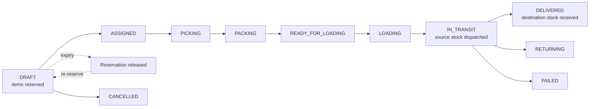

# Logistics Management System

Logistics Management System is a full-stack web application for coordinating company, workforce, warehouse, inventory, fleet, and transport operations. It combines operational workflows with scoped access control, lifecycle validation, audit records, notifications, reporting, and data exchange in a single multi-company system.

## Overview

The system models logistics work around companies and their resources. A company owns users, employees, products, warehouses, and vehicles. Warehouses are divided into zones and bin locations; aggregate and bin-level inventory records track product quantities, reservations, valuation, and stock thresholds. Stock movements and inventory counts provide controlled ways to change that inventory.

Transport orders connect source and destination warehouses with products, a vehicle, and a driver. Their lifecycle coordinates inventory reservation, dispatch, receipt, vehicle availability, and operational assignments. Shifts and tasks organize employee work, while notifications, comments, attachments, activity logs, change history, dashboards, and reports provide operational context and traceability.

## Key Features

### Authentication and authorization

- Stateless email/password login with signed JWT access tokens.
- BCrypt password hashing and Spring Security request filtering.
- Backend-enforced role, capability, company, warehouse, assignment, and ownership checks.
- Public company-registration flow with tracking-token status lookup; all other business APIs require authentication except country, city, and timezone reference reads.
- Frontend protected routes and permission-aware actions backed by the same role model.

### Company, user, and employee management

- Company onboarding requests with review, approval, rejection, cancellation, and company/admin creation.
- Company, user, role, employee, and employee-profile change-request administration.
- Employee termination/reactivation, position changes, optional user linkage, primary warehouse, and additional warehouse assignments.
- Assignment access types for primary, worker, manager, dispatch, and view-only warehouse access.

### Warehouses and inventory

- Warehouse creation, status management, manager assignment, and capacity controls.
- Hierarchical warehouse zones and bin locations with location-specific inventory.
- Product catalog, warehouse inventory, minimum-stock levels, reserved and available quantities, average unit cost, and currency.
- Inventory-count sessions with generated count lines, counting/review stages, discrepancy handling, approval, adjustment creation, and closure.

### Stock movements

- Inbound, outbound, transfer, adjustment, write-off, and return operations.
- Warehouse-first product and bin selection using scoped lookup endpoints.
- Backend-derived cost snapshots from inventory state; users do not provide unit cost, currency, or total movement cost.
- Quantity, reservation, bin, warehouse-capacity, and lifecycle validation.
- Approval for qualifying adjustments, execution/cancellation/rejection, reversal records, and lot/serial trace history.

### Transport and fleet management

- Transport orders between warehouses with one or more product items.
- Source-stock reservation, expiry and atomic re-reservation of draft items.
- Driver, shift, workload, vehicle capacity, schedule, status, and maintenance-conflict checks.
- Coordinated dispatch and destination receipt inventory effects with historical item cost snapshots.
- Vehicle catalog, availability lifecycle, assignment history, and maintenance records.

### Workforce operations

- Planned shifts with activation, completion, cancellation, and sickness-related cancellation handling.
- Typed, prioritized tasks that can be linked to warehouses, transports, vehicles, stock movements, or other operational context.
- Role- and assignment-scoped task lists, reassignment, and controlled status transitions.

### Operational visibility and collaboration

- Role-specific dashboards with summary cards, alerts, trends, and actionable links.
- In-app notifications with unread counts, acknowledge/resolve actions, and live Server-Sent Events (SSE) updates.
- Operational comments and uploaded attachments associated with supported business entities.
- Activity timeline, activity log, field-level change history, and recorded domain events.
- Filtered transport, inventory, and employee-task reports with CSV export; audit logs support CSV and XLSX export.
- Permission-aware CSV imports for products, vehicles, warehouses, warehouse inventory, and employees.

## Roles and Access Control

The code defines seven roles. A user's role establishes the broad capability set; backend services and repositories then narrow access to the appropriate business scope.

| Role | Scope | Main responsibilities |
| ---- | ----- | --------------------- |
| `OVERLORD` | Global | Reviews company registrations and administers system-wide companies and reference-level resources. Global access is still subject to protected write rules. |
| `COMPANY_ADMIN` | Company | Administers the company's users, employees, warehouses, products, inventory, vehicles, transports, tasks, and reports. |
| `HR_MANAGER` | Company workforce | Manages eligible employees, users, shifts, profile-change requests, HR tasks, and workforce reporting. |
| `WAREHOUSE_MANAGER` | Company reads and managed-warehouse operations | Manages assigned warehouses, inventory, counts, stock operations, warehouse tasks, and warehouse workforce. Transport-order reads are company-wide where required for operations; mutations remain scoped. |
| `DISPATCHER` | Company transport operations | Plans and updates transports, works with eligible drivers and vehicles, and accesses transport-related stock and task context. |
| `DRIVER` | Assigned work | Reads assigned transports and tasks, uses transport-related vehicle/reference data, and performs permitted lifecycle actions. |
| `WORKER` | Assigned warehouses and work | Reads assigned transports/tasks and performs permitted inventory, count, and stock operations in assigned warehouses. |

Access control is layered:

1. Spring Security authenticates the JWT and attaches role authorities.
2. Controller method rules restrict endpoint-level operations.
3. Authorization and access-guard services enforce company, managed-warehouse, assigned-warehouse, transport, and self-assignment scope.
4. Lifecycle policies determine whether the current role may perform a particular status transition.
5. Repository queries and service validation constrain returned and mutated records to the authenticated context.

Frontend route guards and hidden or disabled actions improve navigation, but they are not the security boundary. The backend remains authoritative for every protected read and write.

## Core Business Workflows

### Warehouse and inventory flow

```text
Company
  └─ Warehouse
       ├─ Warehouse Inventory (product totals, reservations, valuation)
       └─ Zone
            └─ Bin Location
                 └─ Bin Inventory (physical quantity by product)
```

A warehouse contains typed zones, and each zone contains bin locations. `WarehouseInventory` holds the aggregate product position for a warehouse; `BinInventory` distributes physical stock across bins. Services validate that quantities and reservations remain non-negative, available stock is `quantity - reservedQuantity`, bin changes match the warehouse context, and capacity is not exceeded. Inventory counts compare expected and counted quantities and can create controlled adjustment movements for approved discrepancies.

### Stock movement flow

1. The user selects an operation type, warehouse context, product, applicable source/destination bins, quantity, and operational reason/reference data.
2. The backend locks and validates the relevant inventory, available quantity, reservations, bin stock, company/warehouse scope, and capacity.
3. Cost is read from the current inventory valuation and normalized into immutable `unitCost`, `currency`, and `movementCost` snapshots on the movement.
4. The movement follows `DRAFT`, `PENDING_APPROVAL` when required, `APPROVED`, and `EXECUTED`, or one of the rejection/cancellation paths.
5. Execution updates aggregate and bin inventory in one transaction and records before/after quantity and reservation values.
6. An executed movement may be reversed through a linked compensating movement rather than by erasing history.

Supported business movement types include inbound/outbound stock, transfer pairs, positive or negative adjustments, write-offs, returns, and system reservation/release movements.

### Transport order flow


```mermaid
flowchart LR
    A[DRAFT<br/>items reserved] --> B[ASSIGNED]
    B --> C[PICKING]
    C --> D[PACKING]
    D --> E[READY_FOR_LOADING]
    E --> F[LOADING]
    F --> G[IN_TRANSIT<br/>source stock dispatched]
    G --> H[DELIVERED<br/>destination stock received]
    A -. expiry .-> X[Reservation released]
    X -. re-reserve .-> A
    A --> Z[CANCELLED]
    G --> R[RETURNING]
    G --> Y[FAILED]
```

- A transport order identifies different active source and destination warehouses, schedule, priority, driver, vehicle, and item quantities.
- Item creation reserves available source stock. Draft reservations expire after the configured TTL and can be renewed atomically before assignment.
- Before operational progress, the service checks reservation integrity, destination capacity, driver role and shift coverage, workload overlap, vehicle availability/capacity, schedule conflicts, and maintenance.
- Assignment reserves the vehicle. Moving to `IN_TRANSIT` consumes reserved source stock and records dispatched quantities; delivery receives the items into destination inventory and records delivered quantities.
- Cancellation releases pre-dispatch reservations. Failure and return paths distinguish whether dispatch occurred so stock and vehicle state remain consistent.
- Item-level unit cost, currency, and movement cost are retained as historical transport snapshots.

The configured lifecycle also supports rescheduling and the statuses `DRAFT`, `ASSIGNED`, `PICKING`, `PACKING`, `READY_FOR_LOADING`, `LOADING`, `IN_TRANSIT`, `DELIVERED`, `FAILED`, `RETURNING`, `RESCHEDULED`, and `CANCELLED`.

### Employee, shift, and task flow

Employees belong to a company, may be linked to a login user, and may have a primary warehouse plus additional warehouse assignments. Managers schedule shifts for eligible employees; the lifecycle progresses through `PLANNED`, `ACTIVE`, `FINISHED`, or `CANCELLED`, with validation for time ranges and overlapping work. Tasks are created in operational context, assigned only to eligible employees, and progress through `NEW`, `OPEN`, `ASSIGNED`, `IN_PROGRESS`, `BLOCKED`, `COMPLETED`, or `CANCELLED`. Driver and worker reads and transitions are restricted to their assigned work.

### Vehicle flow

Vehicles belong to a company and use `AVAILABLE`, `RESERVED`, `IN_USE`, `MAINTENANCE`, or `OUT_OF_SERVICE` status. Transport assignment requires an active, available vehicle without overlapping transport or maintenance commitments and with sufficient configured capacity. Transport lifecycle transitions reserve, activate, and release the vehicle. Maintenance records separately track planned/in-progress/completed/cancelled work and prevent conflicting assignments.

## Technology Stack

| Layer | Technology |
| ----- | ---------- |
| Backend | Java 21, Spring Boot 4.0.3, Spring Web MVC |
| Persistence | Spring Data JPA, Hibernate, Bean Validation |
| Database | Microsoft SQL Server 2022 CU25 Developer |
| Migrations | Flyway with SQL Server support |
| Security | Spring Security, JJWT 0.12.5, BCrypt |
| API documentation | springdoc OpenAPI/Swagger UI 3.0.2 in non-production profiles |
| Frontend | React 19.2.8, TypeScript 5.9, Vite 8.2.1 |
| UI and forms | Material UI 7.3.11, Emotion, React Hook Form, Zod |
| Data and routing | TanStack Query 5.101.4, Axios, React Router 7.18.2 |
| Charts | Recharts 3.8 |
| Testing | Spring test modules, JUnit, H2, Testcontainers 1.19.8, Vitest, Testing Library |
| Containerization | Docker Compose, Eclipse Temurin 21, Node.js 22.13 |
| Build tools | Maven Wrapper, npm 11.19 in the frontend image |

## Architecture

```text
Browser
   |
   | HTTP / REST + JWT
   | SSE notifications
   v
React + TypeScript frontend (Vite development server and /api proxy)
   |
   v
Spring Boot REST controllers
   |
   v
Service, authorization, lifecycle, audit, and mapping layers
   |
   v
Spring Data JPA repositories
   |
   v
Microsoft SQL Server

Backend file storage <--- operational attachment service
Scheduled jobs       ---> lifecycle monitoring, reservation cleanup, notifications
```

The frontend is organized by feature and uses shared API, authentication, lookup, table, form, lifecycle, and presentation infrastructure. The backend follows controller-service-repository layering, with DTOs separating API contracts from JPA entities. Cross-cutting packages provide security, lifecycle policies, observability, error handling, scheduling, and operational access validation.

## Repository Structure

```text
logistic-system/
├── backend/
│   ├── src/main/java/rs/logistics/logistics_system/
│   │   ├── controller/       # REST endpoints
│   │   ├── service/          # business workflows and scope enforcement
│   │   ├── repository/       # JPA data access
│   │   ├── entity/ and dto/  # persistence and API models
│   │   ├── security/         # JWT and request protections
│   │   ├── lifecycle/        # status transition policies
│   │   └── scheduler/        # periodic lifecycle work
│   ├── src/main/resources/db/migration/  # Flyway SQL migrations
│   ├── pom.xml
│   └── Dockerfile
├── frontend/
│   ├── src/app/              # providers, layouts, routing, guards
│   ├── src/core/             # API, auth, permissions, shared state
│   ├── src/features/         # domain-oriented UI modules
│   ├── src/shared/           # reusable components and utilities
│   ├── package.json
│   └── Dockerfile
├── docker/sql/init-database.sql
├── docker-compose.yml
└── README.md
```

## Database and Migrations

Microsoft SQL Server is the runtime database. The `db-init` Compose service creates the configured database if necessary, after which the backend runs versioned Flyway migrations from `backend/src/main/resources/db/migration`. Hibernate schema generation is disabled (`ddl-auto=none`), so Flyway is the only mechanism that creates and evolves the schema; Flyway validation is enabled at startup.

The migration history creates the schema, reference catalogs, roles, an initial system user, demo companies, operational scenarios, and later forward-only corrections and workflow extensions. Current demo datasets include warehouses, products, inventory, employees, vehicles, shifts, tasks, stock movements, transport orders, notifications, and audit-oriented records. Seed credentials are intentionally not reproduced here; inspect the public seed migrations if a development login is required.

Compose persists SQL Server data in `sqlserver-data` and uploaded operational attachments in `attachment-data`. The `frontend-node-modules` volume keeps container dependencies separate from the bind-mounted frontend source.

## Demo Data

Demo data is installed automatically by Flyway during the first startup of a new database volume. The seed migrations create the system roles and initial system account, followed by multiple company scenarios with users and employees in each operational role, warehouses and locations, products and inventory, fleet records, shifts, tasks, stock movements, transport orders, notifications, and audit data. Later migrations correct and extend those datasets while preserving the forward-only migration history.

Because the demo passwords are stored as public development seed hashes rather than runtime configuration, this README does not duplicate credentials. The seed migration files are the authoritative source for intentionally seeded development identities.

## Security

- Login is handled by `POST /api/auth/login`; `GET /api/auth/me` restores the authenticated user context.
- The frontend stores the access token in browser local storage and sends it as `Authorization: Bearer <token>` through the shared Axios client.
- The backend is stateless, validates JWT signatures and expiry, and uses BCrypt for stored passwords.
- Controller annotations and service-level authorization enforce roles and data scope; lifecycle transitions apply additional role-specific rules.
- CORS origins are configurable. CSRF is disabled because the API uses bearer-token authentication rather than server sessions.
- Standard JSON error responses include stable error codes, validation details, and request correlation identifiers where available.
- Write protections include idempotency support, request-rate safeguards, and special protection for system-level writes.

Never commit real database passwords or JWT secrets. The existing local `.env` files are ignored by Git.

## Getting Started

### Prerequisites

For the recommended setup, install only:

- Git
- Docker Engine with Docker Compose v2 (Docker Desktop is suitable on Windows and macOS)

Java, Maven, Node.js, npm, and SQL Server run inside containers.

### Clone the repository

```bash
git clone https://github.com/filipDjekic/logistic-system.git
cd logistic-system
```

### Environment configuration

The Compose setup reads the existing `.env` file in the repository root. It must define `DB_PASSWORD` and `JWT_SECRET`; the remaining values have Compose defaults or are optional overrides:

```dotenv
DB_PASSWORD=<strong SQL Server password>
JWT_SECRET=<long random signing secret of at least 32 bytes>

# Optional overrides
DB_NAME=Logistics
DB_USERNAME=sa
DB_PORT=1433
BACKEND_PORT=8080
FRONTEND_PORT=5173
JWT_EXPIRATION_MS=86400000
VITE_APP_NAME=Logistics management system
CHOKIDAR_USEPOLLING=true
```

`DB_PASSWORD` must satisfy SQL Server password complexity requirements. Do not replace the current secret values with these placeholders, expose them in documentation, or commit the `.env` file.

### Start the application

```bash
docker compose up --build -d
```

The startup order is health-aware: SQL Server starts first, `db-init` creates the database, the backend applies Flyway migrations and becomes healthy, and then the frontend starts.

### Check status and logs

```bash
docker compose ps
docker compose logs -f backend
docker compose logs -f frontend
docker compose logs -f db
```

### Stop the application

```bash
docker compose down
```

This stops and removes containers while retaining database, attachment, and frontend dependency volumes.

### Full local reset

```bash
docker compose down -v
docker compose up --build -d
```

Warning: `docker compose down -v` permanently deletes the local SQL Server database volume, uploaded attachment volume, and container-managed frontend dependencies. On the next start, the database is recreated and all Flyway migrations and seed migrations run again.

### Application URLs

Default ports are shown; environment overrides change them.

| Service | URL |
| ------- | --- |
| Frontend | `http://localhost:5173` |
| Backend API | `http://localhost:8080/api` |
| OpenAPI JSON (development profile) | `http://localhost:8080/v3/api-docs` |
| Swagger UI (development profile) | `http://localhost:8080/swagger-ui/index.html` |
| SQL Server | `localhost:1433` |

The frontend proxies `/api` requests to the backend inside the Compose network. API documentation endpoints are disabled by the production profile.

### Optional local development

To run outside Compose, provide a reachable SQL Server database and the environment variables used by `application.properties` (`DB_URL`, `DB_USERNAME`, `DB_PASSWORD`, `JWT_SECRET`, and optional overrides). Then run:

```bash
cd backend
./mvnw spring-boot:run
```

On Windows, use `mvnw.cmd spring-boot:run`. In another terminal:

```bash
cd frontend
npm ci
npm run dev
```

The local Vite server proxies `/api` to `http://localhost:8080` by default.

## API Overview

The API is grouped by domain rather than exposed as one generic CRUD endpoint set. Principal route groups include:

```text
/api/auth
/api/company-registration-requests
/api/companies
/api/users
/api/roles
/api/employees
/api/employee-warehouse-assignments
/api/shifts
/api/tasks
/api/warehouses
/api/warehouse-locations
/api/warehouse-inventory
/api/products
/api/inventory-counts
/api/stock-movements
/api/stock-movement-requests
/api/transport-orders
/api/transport-order-items
/api/vehicles
/api/vehicle-maintenance
/api/notifications
/api/operational-comments
/api/operational-attachments
/api/dashboard
/api/reports
/api/data
/api/activity-logs
/api/activity-timeline
/api/history
```

Dedicated lookup routes under `/api` provide scoped warehouse, product, vehicle, employee, transport, stock-movement, zone, bin, and company options for forms. Most endpoints require a valid JWT and the role/scope appropriate to the requested resource.

## Frontend

The React application uses feature modules that co-locate pages, API adapters, hooks, types, validation, and domain components. Shared infrastructure provides authenticated Axios requests, TanStack Query caching, route guards, capability checks, paginated and filterable data tables, reusable entity lookups, lifecycle controls, operational summaries, metadata displays, dialogs, and error handling.

The UI includes public registration and status pages, authenticated role-specific navigation, responsive list/detail/form pages, server-backed search and filters, dashboards built with Recharts, notification streaming, report downloads, and permission-aware imports. React Hook Form and Zod handle client-side form validation; backend validation remains authoritative.

## Validation, Error Handling, and Data Integrity

- Jakarta Bean Validation checks API DTO structure and field constraints.
- Services enforce cross-entity business rules, scope, active status, lifecycle transitions, capacity, availability, schedule overlap, and assignment eligibility.
- Transactional stock, reservation, transport, inventory-count, and reversal operations update related records atomically.
- Pessimistic repository locks protect contested inventory, vehicle, driver, and transport operations; version columns provide optimistic concurrency checks on key records.
- Flyway migrations define foreign keys, unique constraints, check constraints, indexes, and schema corrections. Flyway validates the applied migration history at startup.
- Central exception handling returns consistent API errors without exposing stack traces through normal responses.
- Audit, change-history, and domain-event records preserve important operational changes instead of relying only on mutable entity state.

## Import and Export

CSV import is available through the relevant product, vehicle, warehouse, inventory, and employee screens according to the authenticated role. Imports accept files up to 5 MB, validate headers and individual rows, apply the same service validation and company/warehouse scope as manual entry, and return structured row errors. The operation is transactional: invalid input does not silently create an unscoped partial dataset.

Transport, inventory, and employee-task reports can be filtered in the frontend and downloaded as UTF-8 CSV. Activity and audit logs support CSV or XLSX export. Available import and export actions are returned by `/api/data/capabilities` for the current user.

## Testing

Backend tests include unit, service, security, controller, repository, lifecycle, and integration coverage. H2 supports fast test profiles, while the `flyway-it` Maven profile uses Testcontainers with SQL Server to validate real migration behavior when Docker is available.

```bash
cd backend
./mvnw test
./mvnw verify -Pflyway-it
```

Frontend validation uses TypeScript, ESLint, Vitest, Testing Library, and the production build:

```bash
cd frontend
npm ci
npm run typecheck
npm test
npm run lint
npm run build
```

On Windows, use `mvnw.cmd` for Maven Wrapper commands.

## Project Scope

This repository is a university software-engineering project demonstrating the design and implementation of a full-stack logistics information system. Its scope includes realistic cross-domain workflows, authorization boundaries, data integrity controls, operational traceability, containerized development, and automated testing without claiming deployment-specific production readiness.
